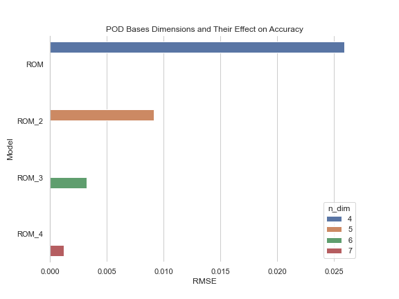

<style type="text/css">

h1.title {
  font-size: 38px;
  color: Black;
  text-align: center;
}
h4.author { /* Header 4 - and the author and data headers use this too  */
    font-size: 18px;
  font-family: "Times New Roman", Times, serif;
  color: Black;
  text-align: center;
}
h4.date { /* Header 4 - and the author and data headers use this too  */
  font-size: 18px;
  font-family: "Times New Roman", Times, serif;
  color: Black;
  text-align: center;
}

</style>


```{r setup, include=FALSE}
knitr::opts_chunk$set(echo = FALSE, warning = FALSE, message = FALSE)
```

```{r Libraries}
library(tidyverse)
```

## Introduction

|       In this work is a view of a subject that is a bit of a passion of mine as of late. This subject is Model-Order Reduction and the application of this subject on the 1-Dimensional representation of the heat/diffusion equation. The primary methodology of this work is the creation of a reduced-basis representation of this equation, that is then mapped to the full order basis and displaying the metrics like accuracy and computation cost associated with this action. This report details the main ideas behind the mathematics involved in solving a time-depending partial differential equation, the mathematics involved in applying methods like the Proper Orthogonal Decomposition using the singular value decomposition on the resulting state vectors, and the resulting analyses done to understand relationships between parameter and reduced-order basis selection. The entire set of scripts are written in python with all of the code, images, and resulting snapshot matrix data available [here](https://github.com/angel-sarmiento/ROM-Projects/tree/master/1D-Heat_equation).


## The 1-Dimensional Heat/Diffusion Equation 

The 1-Dimensional Heat/Diffusion Equation is defined here as:

$$\frac{\partial u}{\partial t } = \mu \frac{\partial ^2 u }{\partial x ^ 2}$$
$$u_t = \mu * u_{xx}$$
where $\mu$ is known as the *diffusivity* of the medium. The boundary conditions (Dirichlet and Neumann) are as defined below: 


\begin{align}
  u_t &= \mu * u_{xx}   \qquad \text{for   } 0 <= x <= 1 \\
  u(0,t)   &= 1 \\
  u_x(1,t) &= 0 \\
  u(x,0)   &= cos(3* \pi *x/2)
\end{align}


|       Notice that this is a time-dependent Partial Differential Equation (PDE). In order to solve this, we implement a Backward in Time, Central in Space (BTCS) scheme for discretization. BTCS is chosen here since it is an implicit method without limitations on solutions like FTCS for stability. It also involves a smaller number of computations than the *Crank-Nicholson scheme*, making it simpler to program. For this investigation, importance is placed on the comparative advantage between two models, not on the accuracy of the numerical solution of the heat equation. The discretization is shown below:

$$\frac{u_{i, n+1} - u_{i, n}}{\Delta t} = \alpha \frac{u_{i+1,n+1} - 2u_{i, n+1} + u_{i-1, n+1}}{(\Delta x)^2}$$
where $u_{i, n} \approx u(x_i, t_n)$. Simplified, this yields, 
$$u_{i, n} = (1+2\lambda)u_{i, n+1} - \lambda(u_{i+1, n+1} + u_{i-1, n+1})$$
for $i = 1, 2,..., M-1$ and for $n = 1, 2, ..., N$, Solving for the system each time. As stated above, this method is *unconditionally stable* and convenient for the purposes listed here. The code used to implement this is available [here](https://github.com/angel-sarmiento/ROM-Projects/blob/master/1D-Heat_equation/python/generate_snapshots.py)

## POD, SVD, and Snapshot Matrices

|       The Proper Orthogonal Decomposition (POD) is a method used to solve lower-order versions of reference models that is intended to be faster than solving the reference model fully each time. It is a method of projection onto subspaces where the basis consists of dimensions that are orthogonal to one another.  The reference model in this case is described above as the 1-D heat equation. Solving the reference model initially yields snapshots for each *state* of the model, given in this case by u solved at each time t or $u(t_1), u(t_2)...$. These state vectors are collected and arranged as a snapshot matrix for which the *Singular Value Decomposition* (SVD), $X = U \Sigma V^T$ is applied to create a reduced basis. 

|       The new basis state vectors are denoted by $x(t) \approx \Psi^x \phi^x(t)$ where $\Psi^x$ is the reduced-order basis vectors and $\phi^x(t)$ is the coefficient vector of the same basis. Selecting the number of basis dimensions is vital to maintaining a larger proportion of variance of the full-order model (FOM). A lower number of dimensions in the reduced-basis state vectors creates a lower order differential algebraic system solution, which can be faster than solving the FOM in instances where the FOM is more complicated than the one described above. Projecting this reduced basis back to the full-dimensional representation involves performing a method like Galerkin's:
$$\Psi^T B \Psi \frac{d\phi}{dt}(t) =  \Psi^T A \Psi \phi(t) + \Psi^T g(\Psi \phi(t))$$
or by another method, eventually solving a system of equations using the formula $Ax = b$ where A is a sparse, triangular matrix. The resulting triangular matrix is a matrix with $(1+2\lambda)$ in the center diagonal and $-\lambda$ in the outer diagonals (see above). Also where $b$ is $u_{i-1, n-1}$ . This can then be solved using LU Factorization for faster computation or by just solving $Ax = b$ in any solver. The Python code for this is implementation without Galerkin projection or LU Factorization is available [here](https://github.com/angel-sarmiento/ROM-Projects/blob/master/1D-Heat_equation/python/compare_fom_rom.py) where this is implemented with $t = 1$ second. 

## Implementations and Analyses

|       Using the methods above, analyses were carried out to determine the effectiveness and/or ineffectiveness of said methods in generating solution sets with ROM using POD. Starting out, a simple comparison with a fixed $\mu$ of $0.1$ and POD basis consisting of the first 4 dimensions extracted from the SVD. The FOM model was implemented using BTCS. 

|       These models are implemented by simulating a full second of the heat equation, computing state vectors at sub-intervals of $1/129$ of a second. A snapshot matrix was calculated with FOM's with numerous initial conditions and initial values. Where as the ROM created from those snapshot vectors is evaluated at the boundary and initial conditions described above. A FOM was calculated with these constraints as well. These two models can be seen below. 

```{r First Model Comparison, echo = FALSE, fig.align='center', out.height="50%", out.width="50%"}
knitr::include_graphics("../python/images/models.gif")
```

|       As is shown, the ROM in the first moments is off from the FOM. This is probably due to the range of boundary conditions implemented in generating the snapshots matrix. Over time however, the ROM computes very similar values for u. This demonstrates that the approach works despite the ROM only beginning with 4 dimensions as opposed to the FOM's 128. 

|       What happens when model parameters are altered however? Since this is only a 1-Dimensional equation, there is only one parameter, $\mu$, of interest to be altered other than the amount of variance obtained in our ROM from the snapshots matrix. Keeping the number of dimensions of $\Psi$ the same, the algorithm was ran in a loop to go through each of the different $\mu$ values and then compared in the table below. 

```{r}
mu_mod <- read_csv('../python/data/mu_tests_rom.csv')
kableExtra::kable(mu_mod, format = "html") %>% 
   kableExtra::kable_styling(position = "center")
```
\begin{center}
Table 1. Comparison of ROMs with different values of $\mu$
\end{center}

|       All of these seem to have similar errors to each other, but unfortunately none of these save time over the FOM computation. This may be due to the method used to calculate the reverse-projection of the ROM, which may be slower in 1-D cases where the FOM can be calculated very quickly. Although the RMSEs are relatively similar, some of the mu values yield faster computations for the ROM. The ROM does not perform well at higher values of $\mu$. This might be able to be fixed by using a different value for mu in the snapshot matrix. For the rest of this analysis, we will stick with the $\mu$ value of 0.4 since it performs well and has similar accuracy to the original ROM. The plots below show these models in the same way as above, with our new chosen mu value highlighted in red. The code for these plots is [here](https://github.com/angel-sarmiento/ROM-Projects/blob/master/1D-Heat_equation/python/mu_plots.py)  


```{r Comparison of Models with different Mu Values, fig.align='default', out.height='45%', out.width='33%',  fig.show='hold'}
knitr::include_graphics(c('../python/images/mu_plot_1.gif',
                        '../python/images/mu_plot_2.gif',
                        '../python/images/mu_plot_3.gif'))
```

|       Now that the $\mu$ value is chosen, how does changing the dimensions of the reduced basis effect the accuracy of the ROM? For this step, we will take the number of dimensions to be different values similarly to how it was done with the $\mu$ value above. Running the algorithm again yields the values in the table below.

```{r Table with POD bases model performances}
pod_mod <- read_csv('../python/data/pod_new_bases.csv')
kableExtra::kable(pod_mod, format = "html") %>% 
   kableExtra::kable_styling(position = "center")
```

|       Unsurprisingly, increasing the number of dimensions of the reduced-basis increases the performance of the ROM. For the most part, increasing the dimensions of the reduced-basis also increased the time elapsed when calculating the ROM. The model with the highest accuracy is the model with 7 dimensions in the reduced basis. Let's view the relationship of these models in a simple bar plot.


```{r Model Performance with different number of dimensions captured in POD basis, fig.align='center', out.height='60%', out.width='60%'}


```

|       Running the algorithm yield increasingly impressive results that can be seen similarly to the way view above. This way we can see visually how closely these ROMs match the FOM, despite having a fraction of the dimensions to work with. The plots are shown below, the highest accuracy shown in blue. The code for these plots is [here](https://github.com/angel-sarmiento/ROM-Projects/blob/master/1D-Heat_equation/python/pod_basis_plots.py)

```{r Comparison of Models with different POD bases, fig.align='default', out.height='50%', out.width='50%'}
knitr::include_graphics(c('../python/images/pod_b1.gif',
                        '../python/images/pod_b2.gif',
                        '../python/images/pod_b3.gif',
                        '../python/images/pod_b4.gif'))
```

The higher the number of dimensions included in the reduced-basis the more the ROM aligns with the FOM. But do not take much longer to compute. 

## Conclusion

|       In this investigation, the 1-Dimensional heat/diffusion equation was implemented in a full-order representation and compared with a reduced-order version. The FOM was solved using Backwards in Time Central in Space (BTCS) discretization and then the resulting state-space vector solutions for different time steps were combined in a snapshots matrix. The snapshots matrix was then projected onto a reduced basis using the Singular Value Decomposition. The basis was selected to maintain accuracy without having nearly as many dimensions as the FOM.  
|       In the first comparison, the first four dimensions of the singular values matrix were selected and then solved iteratively over the time period of 1 second divided into 129 sub-intervals. The ROM did not perform better, nor did it perform faster, however this is most likely due to the nature of the problem. Larger dimensional problems like the 2D or 3D variants of the heat equation would most likely weigh heavier on the performance time of the FOM. Since the PDE was simple, the FOM solves rather quickly compared to the ROM counterpart that has to project back to the full dimensions using computationally slow techniques. A solution to this may be to find a more robust method for returning back to the full dimensional space like an autoencoder that learns from a set of snapshot matrices.  
|       After this, the next step was to make comparisons to see how changing the diffusivity constant $\mu$ changed the performance of the models. This was performed iteratively and yielded some interesting results. First, the further $\mu$ was moved away from the initial value in the snapshot matrix, the worse the ROM performed. This makes sense given that the reduced order model is constructed from a reduced version of that snapshotted model. A more surprising result, is difference in time taken to compute the ROM with some $\mu$ values over others. This neither trended upward nor downward.  
|       Finally, after selecting one of the better performing ROMs ($\mu = 0.4$) was selected to be compared using another selection of models, this time varying the number of dimensions of the reduced-basis. From this, it was seen that the higher number of dimensions in the reduced-basis, the more accurate the model was at replicating the FOM. For some reason, the models with higher dimensional reduced-basis performed their computations faster, while having much better accuracy. 


## Future Work

For future work, there are some key things I would like to approach. First, I would like to apply these same methodologies with LU-factorization and Galerkin's method on higher dimensional systems described by PDEs. This could be more physics based simulations like the Navier Stokes equations. Next I would like to configure a more robust method for mapping the projected, reduced-order state vectors into the full-dimensional space. There are many novel approaches using autoencoders, cluster networks, etc. in everything from model-based to model-free approaches that seem useful and computationally fast. With more experience in these areas, I would like to move onto applications of these methodologies to real-time simulation approaches, where data is streamed to a model that reproduces a full-order solution based on a reduced-order approximation. 

## References 

M. Valbuena, D. Sarabia, and C. de Prada, *A Reduced-Order Approach of Distributed Parameter Models Using Proper Orthogonal Decomposition*, https://doi.org/10.1016/B978-0-444-53711-9.50006-7, Accessed December 3, 2020.   
  
P. Seshaiyer, *Finite Difference Method for the 1D Heat Equation*, University at Texas A&M, Math679, 2012.  
  
G. Recktenwald, *BTCS Solution to the Heat Equation*, Portland State University, ME 448/548.  
  
V. Grigoryan, *Finite differences for the heat equation*, 2012.  
  
W.J. Duncan, *Galerkin’s Method in Mechanics and Differential Equations*, Aeronautical Research Committee Reports and Memoranda, No. 1798, 1937.  
  
C. Farhat and D. Amsallem, *Model Reduction - Proper Orthogonal Decomposition*, Stanford University, CME 345.  
