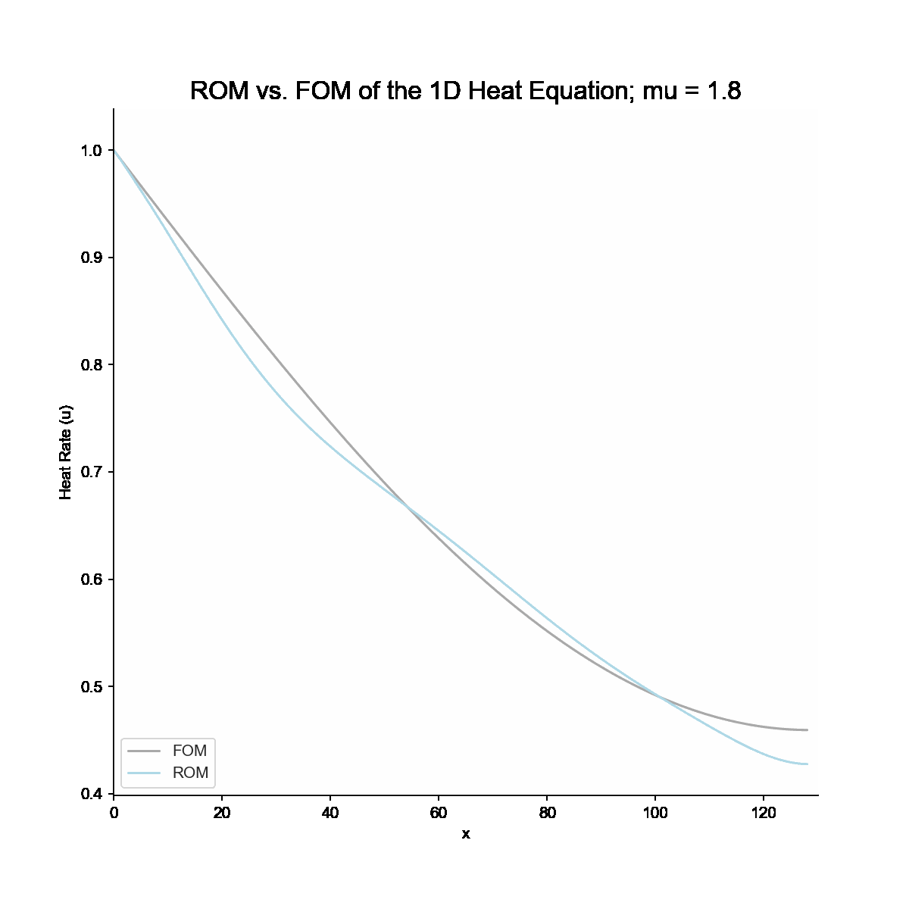

<table class=" lightable-classic2" style="margin-left: auto; margin-right: auto;">
 <thead>
  <tr>
   <th style="text-align:left;"> model </th>
   <th style="text-align:right;"> n_dim </th>
   <th style="text-align:right;"> RMSE </th>
  </tr>
 </thead>
<tbody>
  <tr>
   <td style="text-align:left;"> FOM </td>
   <td style="text-align:right;"> 128 </td>
   <td style="text-align:right;"> 0.0000000 </td>
  </tr>
  <tr>
   <td style="text-align:left;"> ROM </td>
   <td style="text-align:right;"> 4 </td>
   <td style="text-align:right;"> 0.0259282 </td>
  </tr>
  <tr>
   <td style="text-align:left;"> ROM_2 </td>
   <td style="text-align:right;"> 5 </td>
   <td style="text-align:right;"> 0.0125941 </td>
  </tr>
  <tr>
   <td style="text-align:left;"> ROM_3 </td>
   <td style="text-align:right;"> 6 </td>
   <td style="text-align:right;"> 0.0079325 </td>
  </tr>
  <tr>
   <td style="text-align:left;"> ROM_4 </td>
   <td style="text-align:right;"> 7 </td>
   <td style="text-align:right;"> 0.0061479 </td>
  </tr>
</tbody>
</table>

